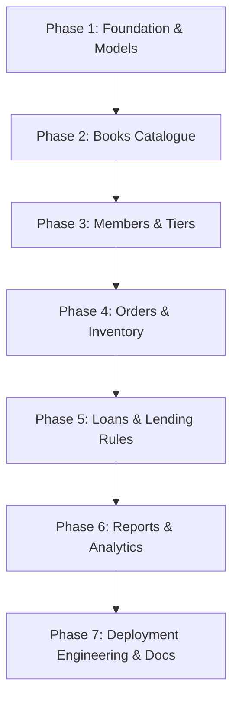

# Sanctum Sanctorum Bookstore — Complete Pipeline Implementation Plan

This document outlines the end-to-end blueprint, architectural design, execution roadmap, and deployment pipeline for completing the **Sanctum Sanctorum** backend take-home assignment in accordance with [ASSIGNMENT.md](ASSIGNMENT.md), [INSTRUCTIONS.md](INSTRUCTIONS.md), and [SPEC.md](SPEC.md).

---

## 1. Executive Summary & Objectives

- **Target**: Transform the partially completed Sanctum Sanctorum codebase into a production-grade, architecturally clean, fully tested, and deployable FastAPI application.
- **Current Baseline**:
  - Tests passing: 73 passed, 125 failed, 4 errors (out of 202 tests).
  - Missing features: Loan model fields, ISBN-13 checksum, PATCH `/books/{id}`, Book listing filters/sorting/total count, Order validation/reservation/transitions, Loan borrowing rules/status/return fee calculation, Member stats, Top-books reporting query.
- **Deliverables**:
  1. 100% passing test suite (`uv run pytest`) against SQLite without external dependencies.
  2. Clean separation of concerns (thin routers, domain logic encapsulated in services).
  3. Incremental, structured Git commit history reflecting logical milestones.
  4. Turnkey deployment configuration (Docker, Render/Railway/Fly.io compatible, Postgres & SQLite compatible).
  5. Comprehensive `NOTES.md` detailing architecture, trade-offs, AI usage, and deployment details.

---

## 2. Architecture & Design Principles

| Layer | Responsibility | Guidelines |
|---|---|---|
| **Schemas (`app/schemas.py`)** | Request/response parsing, data cleansing, syntax validation | Field normalization (ISBN digits, lowercase email, stripped strings), Pydantic validators raising `ValueError` (resulting in HTTP 422). No database queries here. |
| **Routers (`app/routers/*.py`)** | HTTP transport, status codes, dependency injection | Thin controllers. Inject DB session (`get_db`) and virtual clock (`get_now`). Delegate immediately to service functions. |
| **Services (`app/services/*.py`)** | Core business logic, data integrity, domain rules | Enforce domain constraints, order-of-checks as specified in `SPEC.md`, all-or-nothing transactional updates, compute dynamic statuses/stats. Raise `HTTPException` (404, 403, 409). |
| **Models (`app/models.py`)** | Relational data persistence & relationships | SQLAlchemy 2.0 Declarative Mapped models. Safe cascading, indexes on foreign keys and lookups, dual compatibility with SQLite and PostgreSQL. |
| **Time Source (`app/clock.py`)** | Deterministic temporal operations | Strict usage of `get_now()` injected via FastAPI `Depends(get_now)`. Never invoke raw `datetime.now()`. |

---

## 3. Detailed Component Pipeline



---

### Phase 1: Database Foundation & Schema Updates
**Objective**: Complete the ORM models and validation schemas so other services have correct database structures.

1. **Model Enhancements (`app/models.py`)**:
   - Complete `Loan` model:
     - `due_at: Mapped[datetime] = mapped_column(DateTime)`
     - `returned_at: Mapped[Optional[datetime]] = mapped_column(DateTime, nullable=True, default=None)`
     - `late_fee_cents: Mapped[int] = mapped_column(Integer, default=0)`
   - Add index on `Loan.due_at` and `Loan.returned_at` for efficient overdue/active query filtering.
2. **Pydantic Validation Refinements (`app/schemas.py`)**:
   - `normalize_isbn13(raw: str)`:
     - Strip hyphens and whitespace.
     - Enforce 13 numeric digits.
     - Implement ISBN-13 checksum algorithm:
       $$\text{check\_digit} = (10 - (\sum_{i=0}^{11} d_i \times (1 \text{ if } i \text{ even else } 3)) \pmod{10}) \pmod{10}$$
     - Raise `ValueError` if checksum does not match 13th digit.
   - `MemberCreate.normalize_email`:
     - Strip leading/trailing whitespace and lowercase the input email before regex validation.
   - `OrderCreate`:
     - Add `@field_validator("items")`: reject empty items list (`len == 0`) and duplicate `book_id` entries with 422.

---

### Phase 2: Books Service & Router
**Objective**: Robust catalogue management, search, filtering, pagination, and partial updates.

1. **Book Creation (`app/services/books.py`)**:
   - Enforce uniqueness on normalized ISBN with HTTP 409 conflict when already existing.
2. **Book Update (`update_book`)**:
   - Fetch book by `id` or raise 404.
   - Apply fields present in `data.model_dump(exclude_unset=True)`.
   - Silently ignore `isbn` and unknown fields (satisfying spec).
   - Commit, refresh, and return updated record.
3. **Book Router (`app/routers/books.py`)**:
   - Wire up `PATCH /books/{book_id}` returning `BookOut` (200, 404, 422).
4. **Catalogue Listing & Query Engine (`list_books`)**:
   - `q`: Case-insensitive substring match across `title` OR `author` using SQLAlchemy `or_()`.
   - `restricted`: Boolean filter.
   - `min_price` / `max_price`: Inclusive integer range filtering on `price_cents`.
   - `total`: Compute accurate matching records count *before* applying pagination limit and offset.
   - Sorting:
     - `title`: `Book.title.asc(), Book.id.asc()`
     - `-title`: `Book.title.desc(), Book.id.asc()`
     - `price`: `Book.price_cents.asc(), Book.id.asc()`
     - `-price`: `Book.price_cents.desc(), Book.id.asc()`
     - `None`: `Book.id.asc()`
   - Strict pagination using `limit` and `offset`.

---

### Phase 3: Members & Tier Access Control
**Objective**: Member onboarding, tier ranking comparison, and activity statistics.

1. **Tier Ranking Helper (`app/services/members.py`)**:
   - Fix bug in `tier_at_least`: change `>` to `>=` so `master` tier can access restricted items:
     ```python
     return TIER_ORDER.index(tier) >= TIER_ORDER.index(minimum)
     ```
2. **Member Registration (`create_member`)**:
   - Enforce email uniqueness (case-insensitive) raising 409 conflict if already present.
3. **Member Stats (`get_member_stats`)**:
   - Fetch member or raise 404.
   - Aggregate paid orders: `orders_paid` (count), `total_spent_cents` (sum of `total_cents` for `status == 'paid'`).
   - Aggregate loans:
     - `active_loans`: Count where `returned_at is None` (both on-time and overdue).
     - `overdue_loans`: Count where `returned_at is None` and `now > due_at`.
     - `late_fees_cents`: Sum of `late_fee_cents` for loans where `returned_at is not None`.
   - Return structured `MemberStats`.

---

### Phase 4: Orders & Stock Reservation Pipeline
**Objective**: Transaction-safe checkout, tier & bulk discount engine, status lifecycle.

1. **Discount Engine (`calculate_discount_percent`)**:
   - Base tier discounts: `apprentice`: 0%, `adept`: 5%, `master`: 10%, `supreme`: 15%.
   - Additive bulk discount: +5% if total quantity across items $\ge 10$.
2. **Order Creation (`create_order`) — Strict Verification Sequence**:
   - Step 1: 422 checked automatically by Pydantic schema (empty items, quantity < 1, duplicate books).
   - Step 2: 404 check: member must exist; every book must exist.
   - Step 3: 403 check: if any book is `restricted`, verify `member.tier >= master`.
   - Step 4: 409 check: verify every book has `stock >= quantity`. **All-or-nothing** atomic check.
   - Step 5: Decrement stock for all ordered books.
   - Step 6: Snapshot price at order time (`unit_price_cents = book.price_cents`).
   - Step 7: Calculate financial totals:
     $$\text{subtotal} = \sum (\text{unit\_price} \times \text{qty})$$
     $$\text{discount\_cents} = \lfloor (\text{subtotal} \times \text{discount\_percent}) / 100 \rfloor$$
     $$\text{total\_cents} = \text{subtotal} - \text{discount\_cents}$$
   - Step 8: Preserve submitted item ordering in `Order.items`. Save order with status `pending`.
3. **Order Lifecycle Transitions**:
   - `pay_order`: Validate status is `pending` (else 409), transition to `paid`. Stock remains reserved.
   - `cancel_order`: Validate status is `pending` (else 409), transition to `cancelled`. Restore stock for every item in the order (`book.stock += item.quantity`).

---

### Phase 5: Loans & Lending Library
**Objective**: Lending limits, dynamic loan status computation, return processing, and capped late fee calculations.

1. **Dynamic Loan Status (`loan_status`)**:
   - If `returned_at` is set $\rightarrow$ `"returned"`.
   - Else if `now > due_at` $\rightarrow$ `"overdue"` (strict inequality: at exactly `due_at`, status is `"active"`).
   - Else $\rightarrow$ `"active"`.
2. **Late Fee Calculation (`calculate_late_fee`)**:
   - If `now <= due_at` $\rightarrow$ 0 cents.
   - If `now > due_at`:
     $$\text{days\_late} = \lceil (\text{now} - \text{due\_at}) / 1\text{ day} \rceil$$
     $$\text{late\_fee} = \min(\text{days\_late} \times 25, \text{book.price\_cents})$$
     *(using the book's current price at return time)*.
3. **Borrowing Engine (`create_loan`) — Strict Sequence**:
   - Step 1: 404 if member or book missing.
   - Step 2: 403 if book is restricted and member tier below master.
   - Step 3: 409 if member currently has any unreturned overdue loan.
   - Step 4: 409 if member already holds an unreturned loan for the same book.
   - Step 5: 409 if member reached concurrent loan limit (apprentice: 1, adept: 3, master: 5, supreme: unlimited).
   - Step 6: 409 if book stock is 0.
   - Success: `borrowed_at = now`, `due_at = now + 14 days`, `book.stock -= 1`.
4. **Return Loan (`return_loan`)**:
   - 404 if loan not found; 409 if already returned.
   - Set `returned_at = now`, calculate and persist `late_fee_cents`, increment `book.stock += 1`.
5. **Member Loans Listing (`list_member_loans`)**:
   - 404 if member missing.
   - Retrieve member's loans ordered by id ascending.
   - Apply optional computed `status` filter (`active`, `overdue`, `returned`), returning 422 on invalid status query.

---

### Phase 6: Reporting & Analytics
**Objective**: High-performance aggregation for best-selling books.

1. **Top Books Query (`app/services/reports.py`)**:
   - Join `Book`, `OrderItem`, and `Order`.
   - Filter `Order.status == 'paid'`.
   - Group by `Book.id`, `Book.title`.
   - Aggregate: `sum(OrderItem.quantity).label("copies_sold")`.
   - Order by: `copies_sold.desc()`, `Book.title.asc()`.
   - Limit to requested limit (1..50, default 5).
   - Books with 0 paid copies sold excluded automatically.

---

### Phase 7: Deployment Engineering & Turnkey Operations
**Objective**: Satisfy Section 4 of [INSTRUCTIONS.md](INSTRUCTIONS.md) with multi-platform deployment readiness.

1. **Database Multi-dialect Support (`app/db.py`)**:
   - Ensure compatibility with PostgreSQL connection strings (e.g. `postgresql+psycopg://` or `postgresql://`).
   - SQLite-specific connection arguments (`check_same_thread=False`) applied conditionally only when using SQLite.
2. **Containerization & Deployment Assets**:
   - Create multi-stage production `Dockerfile`.
   - Create `render.yaml` (Render Blueprint) and `Procfile` (for Railway/Heroku/Render).
   - Add `.env.example` documenting environment variables (`SANCTUM_DATABASE_URL`, `PORT`).
3. **Turnkey Verification**:
   - Verify app boots via `uvicorn app.main:app --host 0.0.0.0 --port 8000`.
   - Verify static frontend at `/` interacts seamlessly with API.

---

### Phase 8: Git History & Documentation (`NOTES.md`)
**Objective**: High-scoring communication and clean commit narrative meeting Section 2 & Section 3 rubric.

1. **Incremental Commit Sequence**:
   - Commit 1: `feat(models): complete Loan model fields and table relationships`
   - Commit 2: `feat(books): implement ISBN-13 checksum, PATCH endpoint, and catalogue filtering`
   - Commit 3: `feat(members): implement email normalization, tier access fix, and member stats`
   - Commit 4: `feat(orders): implement stock reservation, pricing discounts, and pay/cancel workflows`
   - Commit 5: `feat(loans): implement lending rules, late fee calculation, and return logic`
   - Commit 6: `feat(reports): implement top-books aggregation query`
   - Commit 7: `ci(deploy): add Dockerfile, Procfile, and deployment configurations`
   - Commit 8: `docs: add comprehensive NOTES.md detailing architecture, trade-offs, and AI usage`
2. **`NOTES.md` Content Structure**:
   - Live Deployment URL & testing instructions.
   - Architectural summary & design decisions.
   - Edge cases & trade-offs handled (e.g., case-insensitive sorting, strict due_at boundary, stock race condition defenses).
   - AI Usage transparency section detailing tools, prompts, critical overrides, and evaluation.

---

## 4. Verification & Validation Matrix

| Target | Command | Success Criterion |
|---|---|---|
| **Health Check** | `uv run pytest tests/test_health.py` | 100% pass |
| **Books Suite** | `uv run pytest tests/test_books.py` | 67/67 pass |
| **Members Suite** | `uv run pytest tests/test_members.py` | 23/23 pass |
| **Orders Suite** | `uv run pytest tests/test_orders.py` | 46/46 pass |
| **Loans Suite** | `uv run pytest tests/test_loans.py` | 47/47 pass |
| **Reports Suite** | `uv run pytest tests/test_reports.py` | 19/19 pass |
| **Full Acceptance Test** | `uv run pytest` | 202/202 pass with 0 warnings/failures |
| **Local App Server** | `uv run uvicorn app.main:app` | UI at `http://localhost:8000` functional, Swagger at `/docs` |

---
